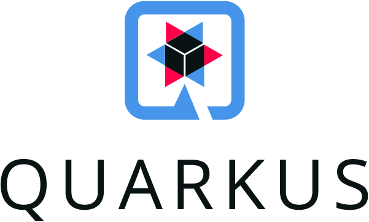

 

# Quarkus - Support of Eclipse Microprofile standard

[](https://travis-ci.org/didier-durand/quarkus-for-eclipse-microprofile) 
 
[](https://codecov.io/gh/didier-durand/quarkus-for-eclipse-microprofile) 
[](https://app.codacy.com/manual/didier-durand/quarkus-for-eclipse-microprofile?utm_source=github.com&utm_medium=referral&utm_content=didier-durand/quarkus-for-eclipse-microprofile&utm_campaign=Badge_Grade_Dashboard) 
[](https://app.fossa.com/projects/git%2Bgithub.com%2Fdidier-durand%2Fquarkus-for-eclipse-microprofile?ref=badge_shield)

**Under Construction**....

This Java project is based on a trival class: the famous "Hello, World!". Its purpose is to use features of the Eclipse Microprofile standard 
support by the Quarkus framework. As per [web site](https://quarkus.io/), Quarkus is "A Kubernetes Native Java stack tailored 
for OpenJDK HotSpot and GraalVM, crafted from the best of breed Java libraries and standards, developped for supersonic subatomic java"

## DevOps & CI/CD 


Project is based on Java v11 as v8 will soon be deprecated by Quarkus team. Dependabot monnitor this repo to propose regular Pull Requests to keep our repository up to date with the very fast evolution pace of Quarkus (framework + Eclipse plugin) and other Maven dependencies.

Additionally, it implements various CI/CD tools available to OSS projects (see badges in header): GitHub build, Travis CI build, code quality analysis via Codacy, code coverage of unit tests via CodeCov, license analysis via FOSSA.


```xml
<dependency>
    <groupId>io.quarkus</groupId>
    <artifactId>quarkus-container-image-docker</artifactId>
    <version>1.7.0.Final</version>
</dependency>
```
License scan details (via FOSSA) :

[](https://app.fossa.com/projects/git%2Bgithub.com%2Fdidier-durand%2Fquarkus-for-eclipse-microprofile?ref=badge_large)

## Java Microprofile

In various classes extending the basic "Hello, World", we implement the various features defined by 
[Eclipse Microprofile project](https://projects.eclipse.org/projects/technology.microprofile) (project site at [https://microprofile.io/](https://microprofile.io/)) 
to make it a good citizen of a Kubernetes cluster. The full list of Eclipse Microprofile features is detailled at [https://github.com/eclipse/microprofile](https://github.com/eclipse/microprofile). 

MicroProfile 3.2 is the 12th platform release : https://download.eclipse.org/microprofile/microprofile-3.2/microprofile-spec-3.2.html

So, to increase compliance with standard and language-agnostic microservices architecture, following dependencies are added to the pom provided by 
sample application.

```xml
<dependency>
	<groupId>org.eclipse.microprofile</groupId>
	<artifactId>microprofile</artifactId>
	<version>${microprofile.version}</version>
	<type>pom</type>
	<scope>provided</scope>
</dependency>
<dependency>
	<groupId>io.quarkus</groupId>
	<artifactId>quarkus-smallrye-health</artifactId>
</dependency>
```

The dependency to org.eclipse.microprofile.microprofile brings all the supported APIs and annotations. The io.quarkus.quarkus-smallrye-health is the implementation by Quarkus of the [health Microprofile features](https://github.com/eclipse/microprofile-health).

## Kubernetes

Quarkus can automatically generate resource descriptions in standard K8s yaml format during build. The proper extension needs to be added to pom file:

```xml
<dependency>
    <groupId>io.quarkus</groupId>
    <artifactId>quarkus-kubernetes</artifactId>
</dependency>
```

This extension will create two files named kubernetes.json and kubernetes.yml in the target/kubernetes/ directory. More details at [https://quarkus.io/guides/kubernetes](https://quarkus.io/guides/kubernetes). A copy of those definitions is stored in /kubernetes directory of the project.